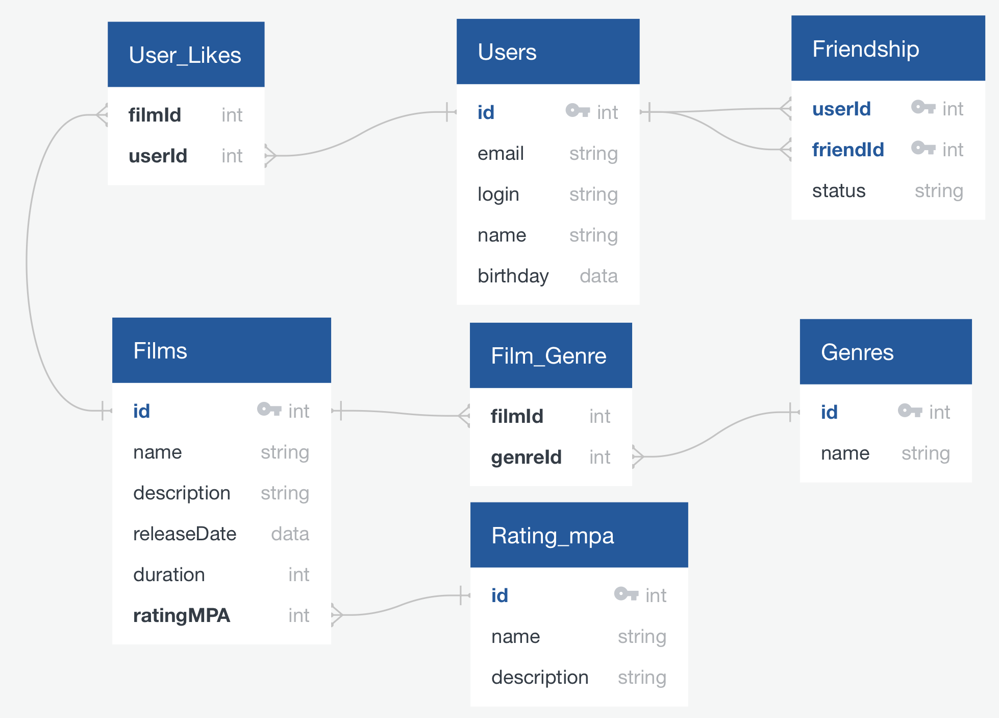

# java-filmorate

Template repository for Filmorate project.

---

## Database diagram from [QuickDBD](https://app.quickdatabasediagrams.com/#/):

Image version:


Описание схемы:

- Films - Таблица фильмов
- Rating_mpa - Таблица рейтингов MPA
- Genres - Таблица жанров
- Film_Genre - связи many-to-many между Films и Genres (жанры)
- Users - Таблица пользователей
- User_Likes - связи many-to-many между Users и Films (лайки)
- Friendship - Таблица запросов дружбы со статусом

Text version:

```
Films as f
-
id PK int
name string
description string
releaseDate data
duration int
ratingMPA int FK >- mpa.id

Film_Genre
-
filmId int FK >- f.id
genreId int FK >- g.id

Genres as g
-
id PK int
name string

Rating_mpa as mpa
-
id PK int
name string
description string

User_Likes
-
filmId int FK >- f.id
userId int FK >- u.id

Users as u
------------
id PK int
email string
login string
name string
birthday data

Friendship as os
----
userId int PK FK >- u.id
friendId int PK FK >- u.id
status string
```